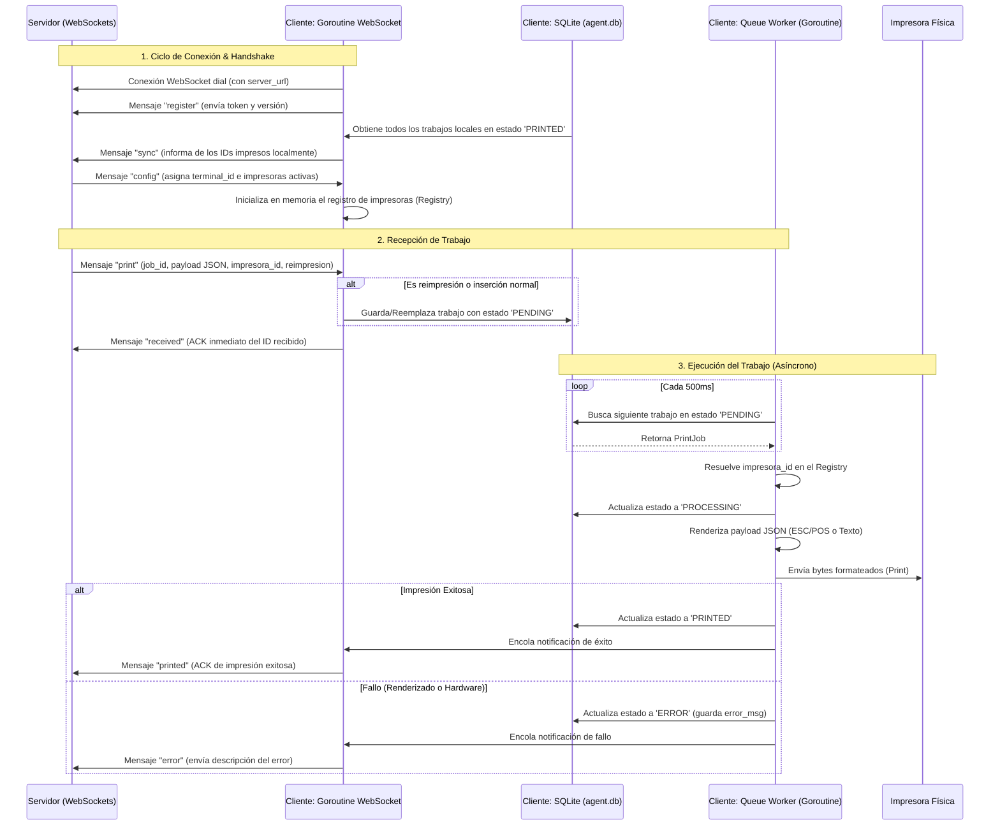

# Flujo de una Petición de Impresión

Este documento describe detalladamente la secuencia de eventos, procesos y transiciones de estado que ocurren en el cliente desde el momento en que se establece la conexión con el servidor hasta que un ticket físico es impreso.

---

## Diagrama General de Flujo

El ciclo de vida se distribuye entre la goroutine de WebSocket, el Worker de la cola y la base de datos local SQLite:



---

## 1. Conexión Inicial y Sincronización (Handshake)

Cuando la aplicación inicia (o tras una desconexión accidental), la goroutine principal de WebSockets ejecuta el método `Run()` de la estructura `Connection`. Esta lógica realiza los siguientes pasos:

1. **Establecimiento de la Conexión (`websocket.Dial`)**: Intenta conectarse a la URL provista en la configuración. Si falla, inicia un reintento utilizando un algoritmo de **backoff exponencial** (iniciando en 1 segundo y duplicándose consecutivamente hasta un tope de 60 segundos) para no saturar al servidor.
2. **Mensaje de Registro (`register`)**: Lo primero que envía el cliente al conectarse exitosamente es un JSON con su token de autenticación y la versión del cliente:
   ```json
   {
     "type": "register",
     "token": "mi_token_secreto_laravel",
     "version": "1.0.3"
   }
   ```
   *Nota: El cliente no almacena un `terminal_id`. El servidor autentica el token contra su base de datos (mediante Laravel) y le asocia internamente el terminal correspondiente.*
3. **Sincronización de Cola (`sync`)**: El cliente realiza una consulta a la base de datos SQLite para extraer los IDs de todos los trabajos locales con estado `"PRINTED"`. Envía esta lista al servidor en un mensaje de sincronización:
   ```json
   {
     "type": "sync",
     "printed_jobs": ["job_uuid_1", "job_uuid_2"]
   }
   ```
   Esto asegura la consistencia e idempotencia: el servidor sabe exactamente qué trabajos ya se imprimieron de forma efectiva en este dispositivo físico.
4. **Configuración de Dispositivos (`config`)**: El servidor responde con la configuración de la terminal: el ID asignado y una lista de especificaciones de las impresoras asociadas a este punto de venta:
   ```json
   {
     "type": "config",
     "terminal_id": "terminal-uuid-1234",
     "printers": [
       {
         "id": "impresora-uuid-5678",
         "tipo": "RED",
         "addr": "192.168.1.150:9100",
         "mode": "escpos"
       },
       {
         "id": "impresora-uuid-9999",
         "tipo": "USB",
         "addr": "Epson_TM_T20",
         "mode": "escpos"
       }
     ]
   }
   ```
   El cliente borra la configuración anterior e inicializa el `printer.Registry` en memoria con estos datos, quedando listo para mapear los trabajos entrantes.

---

## 2. Recepción del Trabajo de Impresión (`print`)

Cuando el backend genera un ticket (por ejemplo, una orden de cocina o boleta de venta), el servidor envía un mensaje WebSocket al cliente con tipo `"print"`.

### Formato del Mensaje Recibido:
```json
{
  "type": "print",
  "job_id": "uuid-del-trabajo-8888",
  "tipo_documento": "comanda",
  "impresora_name_id": "impresora-uuid-5678",
  "reimpresion": false,
  "payload": {
    "options": { "cut": true, "drawer": false },
    "margins": { "dimension_papel": 80.0, "padding": 0.0 },
    "body": [
      { "type": "text", "value": "MESA 5", "bold": true, "size": "double", "align": "center" },
      { "type": "separator" },
      { "type": "text", "value": "1x Lomo Saltado\n2x Inca Kola 500ml", "align": "left" }
    ]
  }
}
```

### Acciones Inmediatas del WebSocket Reader:
1. **Persistencia Local**: El cliente toma el objeto `payload` JSON y lo almacena de inmediato en la base de datos local SQLite (`agent.db`) a través del `Repository`.
   - **Flujo Normal (`reimpresion: false`)**: Se usa `Insert()`. Si el ID del trabajo ya existe en la base de datos local (por ejemplo, porque la petición se repitió), el error de clave primaria duplicada (`ErrDuplicate`) se captura, se emite un warning en logs y se procede a confirmar la recepción al servidor silenciosamente para evitar que el servidor siga reenviándolo.
   - **Flujo de Reimpresión (`reimpresion: true`)**: Se usa `Upsert()` (ejecuta un `INSERT OR REPLACE` en SQLite). El trabajo existente es reescrito y su estado vuelve a `"PENDING"`, forzando que se vuelva a imprimir.
2. **Acuse de Recibo Inmediato (`received`)**: Una vez guardado en la base de datos, el cliente envía un acuse de recibo de inmediato mediante WebSocket al servidor:
   ```json
   {
     "type": "received",
     "job_id": "uuid-del-trabajo-8888"
   }
   ```
   **Este paso es crucial:** El acuse de recibo ocurre de manera asíncrona a la impresión física. Si el papel se traba o la impresora está apagada, el servidor ya sabe que el cliente *tiene* el trabajo seguro en su base de datos local y no intentará reenviarlo por red.

---

## 3. Procesamiento en Segundo Plano (Worker)

El `Queue Worker` funciona de manera autónoma en una goroutine independiente y realiza un bucle continuo de lectura:

1. **Sondeo (Polling)**: Cada `500ms`, el worker consulta en SQLite por el trabajo más antiguo en estado `"PENDING"`.
2. **Espera de Configuración**: Si el worker encuentra un trabajo pero el `Registry` de impresoras está vacío (debido a que la conexión no se ha establecido o el servidor aún no envía el mensaje de `config`), el worker se suspende temporalmente y vuelve a intentar en el siguiente ciclo.
3. **Resolución de la Impresora**: Toma el campo `impresora_id` del trabajo de impresión y lo busca en el `Registry`.
   - Si la impresora no existe en la configuración recibida para esta terminal, el worker no puede continuar. Cambia de inmediato el estado del trabajo a `"ERROR"` en la base de datos con el mensaje `"impresora_id no registrada"`, y notifica al servidor mediante la función callback.
   - *Nota de Fallback:* Si no coincide la ID de impresora pero hay exactamente una impresora en toda la configuración, el sistema la usará como fallback automático para evitar atascos de cola en configuraciones simplificadas.
4. **Transición a PROCESSING**: Actualiza el estado en SQLite a `"PROCESSING"`.
5. **Renderizado del Documento**: Dependiendo del modo definido para la impresora física (`"text"` o `"escpos"`), invoca al motor de renderizado (`renderer.go`) que produce los bytes necesarios para el hardware. Si el JSON está mal formado o no puede interpretarse, el trabajo pasa a `"ERROR"`.
6. **Envío al Hardware**: Llama al método `Print(data)` de la impresora resuelta. El proceso de envío de bytes se ejecuta de forma síncrona.
7. **Finalización y Notificación**:
   - **Caso de Éxito**: Cambia el estado del trabajo a `"PRINTED"` en SQLite. Intenta enviar un mensaje `"printed"` al servidor mediante WebSocket de forma no bloqueante:
     ```json
     {
       "type": "printed",
       "job_id": "uuid-del-trabajo-8888"
     }
     ```
   - **Caso de Error**: Cambia el estado del trabajo a `"ERROR"` en SQLite y registra el mensaje detallado de fallo. Envía un mensaje `"error"` al servidor WebSocket:
     ```json
     {
       "type": "error",
       "job_id": "uuid-del-trabajo-8888",
       "msg": "lp raw -d \"Epson_TM_T20\": exit status 1: printer not found"
     }
     ```

---

## Robustez ante Caídas de Red y Estado Offline

Un pilar de diseño del cliente es que **nunca pierde un ticket** debido a interrupciones de la conexión a internet:

* **Escritura offline**: Si el cliente recibe un trabajo de impresión, lo confirma y la red se cae un milisegundo después, el worker seguirá leyendo de SQLite e imprimirá el ticket en papel sin problemas.
* **Confirmación tardía**: Si la red está caída al momento en que el worker finaliza la impresión, el mensaje de notificación (`printed`) se descarta en el canal de salida en memoria para evitar bloquear al worker.
* **Auto-sincronización en reconexión**: Tan pronto como la red regresa y el cliente se conecta de nuevo, el handshake inicial ejecuta el mensaje `sync`, enviando la lista de todos los trabajos marcados localmente como `"PRINTED"`. El servidor procesa esta lista y marca esos trabajos como completados en la base de datos de la nube.
