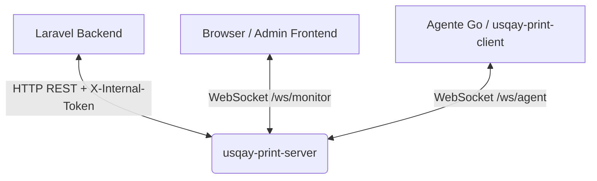

# USQAY Print Server — Documentación de API y Protocolos

Esta documentación detalla los endpoints HTTP REST y las conexiones WebSocket expuestas por el servidor de impresión `usqay-print-server` (escrito en Go) para interactuar con Laravel, los navegadores (monitores) y los clientes locales de impresión (`usqay-print-client`).

---

## Arquitectura de Comunicación



---

## Configuración del Servidor

El servidor de impresión se configura mediante un archivo `config.json` ubicado en su misma carpeta, o mediante **variables de entorno** (que toman precedencia).

### Variables de Entorno / Parámetros
* **`LARAVEL_BASE_URL`** (config: `laravel_base_url`): URL base del servidor Laravel (ej: `http://192.168.1.100:8000`). Utilizada por Go para validar tokens y reportar estados.
* **`INTERNAL_TOKEN`** (config: `internal_token`): Token secreto compartido para autenticar peticiones REST procedentes de Laravel. Debe enviarse en el header `X-Internal-Token`.
* **`PORT`** (config: `port`): Puerto de red en el que escucha el servidor Go (por defecto `8080`).

---

## 1. HTTP REST Endpoints (Laravel $\leftrightarrow$ Print Server)

Todas las llamadas de este grupo requieren el header:
`X-Internal-Token: <INTERNAL_TOKEN>`

### Grupo 1 — Backend de Laravel a Print Server

#### 1.1. Despachar un nuevo trabajo de impresión
* **Ruta:** `POST /api/v1/jobs`
* **Body:**
```json
{
  "job_id": 42,
  "business_id": "empresa-001",
  "terminal_id": "2",
  "impresora_name_id": "192.168.1.100",
  "tipo": "RED",
  "documento_slug": "COMANDA",
  "payload": {
    "mesa": 5,
    "items": [
      {"nombre": "Lomo Saltado", "cantidad": 2, "precio": 21.00}
    ]
  },
  "expira_en": 300
}
```
* **`business_id` es obligatorio** (400 si falta). `terminal_id` **no es único globalmente** — es autoincrement por BD tenant, así que `terminal_id="2"` puede existir simultáneamente en varias empresas. El servidor identifica cada agente por el par `(business_id, terminal_id)`; sin `business_id` no hay forma de saber a qué empresa pertenece el trabajo.
* **Respuesta (`201 Created`):**
```json
{
  "job_id": "42",
  "estado": "pendiente"
}
```
* **Acción:** Go encola el trabajo en memoria y hace un push inmediato vía WebSocket al agente que tenga el par `(business_id, terminal_id)` correspondiente.

#### 1.2. Actualizar estado de comanda (Manual/Bypass)
* **Ruta:** `PUT /api/v1/jobs/{job_id}/status`
* **Body:**
```json
{
  "estado": "IMPRESO", // IMPRESO | ERROR | ENVIADO
  "error_msg": ""      // Opcional: Descripción del error en caso de fallo
}
```
* **Respuesta (`200 OK`):**
```json
{
  "job_id": "42",
  "estado": "IMPRESO"
}
```

#### 1.3. Forzar refresco de configuración en un agente
* **Ruta:** `POST /api/v1/agents/{terminal_id}/config-refresh?business_id=empresa-001`
* **`business_id` es obligatorio como query param** (400 si falta) — mismo motivo que en 1.1.
* **Respuesta (`200 OK`):**
```json
{
  "terminal_id": "2",
  "business_id": "empresa-001",
  "refreshed": true
}
```
* **Acción:** Envía una instrucción `{type: "config_refresh"}` al agente para que cierre su WebSocket, se reconecte y descargue la configuración fresca de Laravel.

---

### Grupo 2 — Laravel BFF a Print Server (Para el Frontend)

#### 2.1. Listar agentes conectados
* **Ruta:** `GET /api/v1/agents`
* **Respuesta (`200 OK`):**
```json
[
  {
    "terminal_id": "2",
    "business_id": "empresa-001",
    "connected_at": "2026-06-10T02:30:00Z",
    "last_ping": "2026-06-10T02:37:15Z"
  }
]
```

#### 2.2. Estado específico de un agente
* **Ruta:** `GET /api/v1/agents/{terminal_id}/status?business_id=empresa-001`
* **`business_id` es obligatorio como query param** (400 si falta).
* **Respuesta (`200 OK`):**
```json
{
  "online": true,
  "last_ping": "2026-06-10T02:37:15Z",
  "pending_jobs": 1
}
```

#### 2.3. Desconexión forzada (Kick)
* **Ruta:** `POST /api/v1/agents/{terminal_id}/kick?business_id=empresa-001`
* **`business_id` es obligatorio como query param** (400 si falta).
* **Body (Opcional):**
```json
{
  "reason": "Mantenimiento programado"
}
```
* **Respuesta (`200 OK`):**
```json
{
  "terminal_id": "2",
  "business_id": "empresa-001",
  "kicked": true
}
```

---

## 2. WebSockets

El servidor expone dos WebSockets en puertos y propósitos totalmente separados.

### 2.1. WebSocket para Agentes (`/ws/agent`)
Destinado exclusivamente a las instancias de `usqay-print-client` instaladas localmente.

#### Handshake de Registro
Al conectar, el agente envía de inmediato:
```json
{
  "type": "register",
  "terminal_id": "2",
  "token": "xxxxx",
  "version": "1.0.3"
}
```
* **Validación en Go:** 
  1. El servidor hace un GET a Laravel:
     `GET <LARAVEL_BASE_URL>/api/tenant/print-configuration/agents/validate?terminal_id=2&token=xxxxx`
     Laravel debe retornar: `{ "valid": true, "business_id": "empresa-001", "terminal_id": "2" }`.
  2. **Identidad del agente y conexiones duplicadas:** el servidor identifica a cada agente por el par `(business_id, terminal_id)` — **no** por `terminal_id` solo. `terminal_id` es un autoincrement por BD tenant (no global), así que dos empresas distintas pueden tener legítimamente ambas un `terminal_id="2"`; sin `business_id` en la key, esas dos conexiones colisionarían.
     Si ya existe una conexión activa para ese mismo `(business_id, terminal_id)`, el servidor **siempre** la patea (`kick`) y registra la nueva — la conexión nueva **nunca se rechaza** (regla de negocio fija, sin excepción ni verificación previa de "salud" de la conexión anterior).
* **Respuesta del Servidor al Agente:**
  `{ "type": "config", "terminal_id": "2" }`

#### Mensajes Recibidos por el Agente (Servidor $\rightarrow$ Agente)
* **Orden de impresión:**
```json
{
  "type": "print",
  "job_id": "42",
  "tipo_documento": "comanda",
  "terminal_id": "2",
  "impresora_name_id": "192.168.1.100",
  "tipo": "RED",
  "documento_slug": "COMANDA",
  "payload": { ... },
  "expira_en": 300
}
```
* **Refresco de Configuración (`config_refresh`):**
```json
{
  "type": "config_refresh"
}
```

#### Confirmaciones del Agente (Agente $\rightarrow$ Servidor)
* **ACK de Recibido en SQLite local:** `{ "type": "received", "job_id": "42" }`
* **Confirmación de Impresión física exitosa:** `{ "type": "printed", "job_id": "42" }`
* **Reporte de Error de impresión:** `{ "type": "error", "job_id": "42", "msg": "Sin papel" }`

---

### 2.2. WebSocket para Monitores (`/ws/monitor`)
Destinado a paneles administrativos en tiempo real en navegadores web.

#### Handshake de Autenticación
Al conectar, el cliente web debe enviar:
```json
{
  "type": "monitor_auth",
  "token": "abc123_short_lived_token"
}
```
* **Validación en Go:** El servidor hace un GET a Laravel:
  `GET <LARAVEL_BASE_URL>/api/tenant/print-configuration/monitor-token/validate?token=abc123_short_lived_token`
  Laravel debe retornar: `{ "valid": true }`.

#### Estado Inicial (Snapshot)
Tras autenticar con éxito, Go le envía al navegador:
```json
{
  "type": "snapshot",
  "agents": [
    {
      "terminal_id": "2",
      "business_id": "empresa-001",
      "online": true,
      "last_ping": "2026-06-10T02:37:15Z",
      "pending_jobs": 0
    }
  ]
}
```

#### Eventos en Tiempo Real
* **Agente conectado:** `{ "type": "agent_connected", "terminal_id": "2", "business_id": "empresa-001", "version": "1.0.3" }`
* **Agente desconectado:** `{ "type": "agent_disconnected", "terminal_id": "2", "business_id": "empresa-001" }`
* **Actualización de carga del Agente:** `{ "type": "agent_update", "terminal_id": "2", "business_id": "empresa-001", "pending_jobs": 3 }`
* **Estado de comanda actualizado:** `{ "type": "job_update", "job_id": "42", "terminal_id": "2", "business_id": "empresa-001", "estado": "IMPRESO" }` // IMPRESO | ERROR | ENVIADO | PENDING

---

## 3. Retornos Asíncronos (Callback Print Server $\rightarrow$ Laravel)

Cuando un agente responde con un estado final (`printed` o `error`), el servidor Go hace una llamada PUT a Laravel para actualizar el estado físico en la BD de Laravel:

* **Ruta:** `PUT <LARAVEL_BASE_URL>/api/tenant/print-configuration/queue/{job_id}/status`
* **Headers:** `X-Internal-Token: <INTERNAL_TOKEN>`
* **Body:**
```json
{
  "estado": "IMPRESO", // o "ERROR"
  "terminal_id": "2",
  "business_id": "empresa-001",
  "error": "Mensaje detallado del error si estado es ERROR"
}
```
