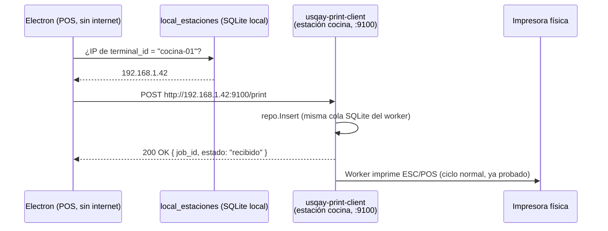

# Propuesta 1 — Agente HTTP local + registro de estaciones en LAN

## Resumen

Cumplir literalmente el contrato que `rest_web_react` ya tiene escrito
(`http://localhost:9100/print`), pero generalizado a toda la LAN: cada `usqay-print-client` abre un
servidor HTTP propio en el puerto 9100, y Electron guarda localmente **a qué IP le corresponde cada
`terminal_id`** para poder llegar a la estación correcta aunque no sea la máquina donde corre Electron.

Es el cambio más chico posible sobre lo que ya existe en los dos repos.

## El problema que resuelve

`lib/print-dispatch.ts` ya asume:

```ts
const PRINT_AGENT_URL = 'http://localhost:9100/print'
```

Eso solo sirve si Electron y el agente están en la misma máquina. Con N estaciones, cada una necesita:

1. Un servidor HTTP propio escuchando en `:9100` (hoy `usqay-print-client` no expone nada, solo abre una
   conexión WebSocket saliente).
2. Que Electron sepa la IP de esa estación en la LAN — no `localhost`.

## Diseño

### 1. `usqay-print-client` gana un servidor HTTP local

Nuevo archivo `usqay-print-client/internal/localapi/server.go`, arrancado junto al resto en `main.go`
(al lado de `go conn.Run(ctx)` y `go worker.Run(ctx)`):

```go
mux := http.NewServeMux()
mux.HandleFunc("POST /print", func(w http.ResponseWriter, r *http.Request) {
    var job PrintJobPayload // mismo shape que PrintJobMsg, sin los campos de transporte WS
    if err := json.NewDecoder(r.Body).Decode(&job); err != nil {
        http.Error(w, "JSON inválido", http.StatusBadRequest)
        return
    }
    if err := repo.Insert(queue.PrintJob{
        ID: job.JobID, TipoDocumento: strings.ToLower(job.DocumentoSlug),
        Payload: string(job.Payload), CreatedAt: time.Now().UTC(), UpdatedAt: time.Now().UTC(),
    }); err != nil {
        http.Error(w, err.Error(), http.StatusInternalServerError)
        return
    }
    w.WriteHeader(http.StatusOK)
    json.NewEncoder(w).Encode(map[string]string{"job_id": job.JobID, "estado": "recibido"})
})
go http.ListenAndServe("0.0.0.0:9100", mux)
```

Esto reutiliza el mismo `repo.Insert` que ya usa el flag `-insert` y el handler de `PrintJobMsg` — el
worker (`worker.go`) no se entera de si el job vino por WebSocket o por HTTP, lo procesa igual. **Cero
cambios en el worker, el renderer o el protocolo ESC/POS.**

Nota de seguridad: sin autenticación en este endpoint cualquier equipo en la misma LAN podría mandar
trabajos de impresión. Aceptable para una LAN de restaurante detrás de su propio router/AP, igual que hoy
`nc`/impresoras de red no tienen auth. Si se quiere cerrar más, un token compartido simple por header
alcanza (no requiere el flujo completo de login).

### 2. Electron necesita saber la IP de cada estación

Se agrega una tabla local (mismo patrón que `local_pedidos`, etc.):

```sql
CREATE TABLE IF NOT EXISTS local_estaciones (
  terminal_id  TEXT PRIMARY KEY,
  ip_lan       TEXT NOT NULL,
  puerto       INTEGER NOT NULL DEFAULT 9100,
  updated_at   TEXT NOT NULL DEFAULT (datetime('now'))
);
```

Se llena de dos formas complementarias:

- **Online:** cuando hay conexión, Laravel ya sabe qué estaciones existen (la pantalla
  `admin/impresion/estaciones-terminal` las administra). Se agrega esa IP como un campo más al configurar
  la estación, y se sincroniza hacia abajo como cualquier otro catálogo (mismo mecanismo que ya trae otros
  datos maestros al SQLite local).
- **Manual, como fallback del día 1:** un campo de texto en la configuración de Electron para setear
  `terminal_id → ip` a mano en locales chicos, sin esperar a que el admin panel tenga el campo. Esto
  destraba la propuesta sin bloquear con trabajo de backend.

### 3. `print-dispatch.ts` cambia una línea, no la lógica

```ts
// antes
const PRINT_AGENT_URL = 'http://localhost:9100/print'

// después
function resolveAgentUrl(terminalId: string): string {
  const estacion = getEstacionLocal(terminalId) // lee local_estaciones
  const host = estacion?.ip_lan ?? 'localhost'
  const puerto = estacion?.puerto ?? 9100
  return `http://${host}:${puerto}/print`
}
```

Todo lo demás — `postToAgent`, `savePendingJob`, `markJobDelivered`, el reintento de
`electron/sync/print-retry.js` — sigue exactamente igual, porque el contrato `PrintJob` no cambia.

## Flujo



Si el POST falla (estación apagada, IP vieja), el camino ya existente de `print-dispatch.ts` guarda el job
en `local_trabajos_impresion` y `print-retry.js` lo reintenta cada 30s — sin cambios.

## Escalabilidad

- Cada estación nueva solo necesita: (a) correr el mismo binario de siempre, y (b) tener su IP cargada en
  `local_estaciones`. No hay límite técnico de estaciones por local más allá de la LAN misma.
- El punto débil es exactamente eso: **la IP hay que mantenerla**. Con DHCP, una estación puede cambiar de
  IP al reiniciar el router. Mitigación de corto plazo: reservar IP fija por MAC en el router del local
  (práctica común en restaurantes chicos). Mitigación real: pasar a la Propuesta 2 (mDNS) cuando esto
  empiece a doler.

## Riesgos / trade-offs

| Riesgo | Impacto | Mitigación |
|---|---|---|
| Firewall de Windows bloquea el puerto 9100 entrante | Alto — la estación parece "no disponible" sin error claro | Agregar la regla de firewall al instalador (`electron-builder`/NSIS ya corre en Windows, se puede sumar un script post-install) |
| IP cambia (DHCP) | Medio | IP fija por MAC en el router, o migrar a Propuesta 2 |
| Sin autenticación en `:9100/print` | Bajo en LAN cerrada, pero real | Token compartido simple por header si el cliente lo pide |
| Duplicar código de inserción de job (HTTP vs WS) | Bajo | Factorizar `handlePrintJob` para que ambos caminos llamen la misma función interna |

## Esfuerzo estimado

- Cliente Go: 1 archivo nuevo (~60-80 líneas) + 1 línea en `main.go`. Sin tocar worker/renderer.
- Frontend: 1 tabla SQLite nueva, 1 función de resolución de IP, 0 cambios en la lógica de reintento.
- Sin cambios en `usqay-print-server` ni en el protocolo WebSocket existente.

Es la propuesta con menor superficie de cambio — apta para tener algo funcionando esta semana.
