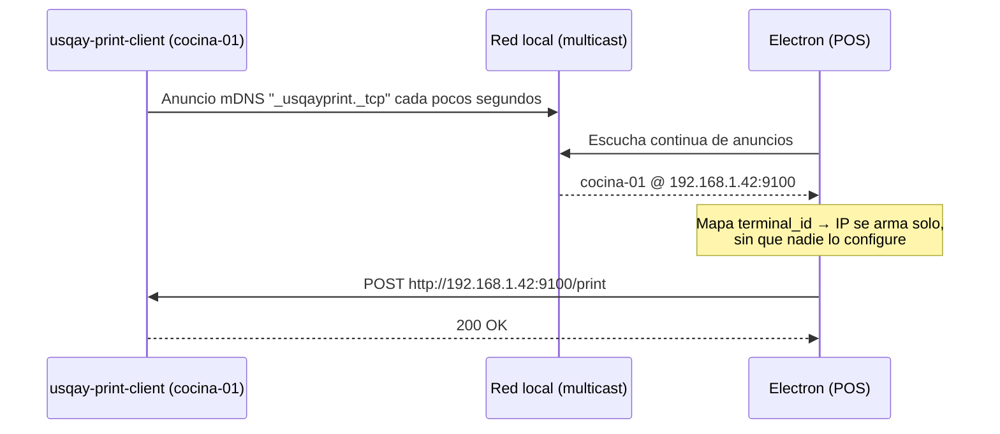

# Propuesta 2 — Descubrimiento automático de estaciones (mDNS/zeroconf)

## Resumen

Misma base que la Propuesta 1 (cada `usqay-print-client` expone `POST :9100/print`), pero en vez de que
alguien mantenga a mano una tabla `terminal_id → IP`, **cada estación se anuncia sola en la red local** y
Electron arma ese mapa automáticamente, en vivo. Es la misma tecnología que usan una impresora AirPrint o
un Chromecast para que el equipo los "vea" sin configurar nada.

## El problema que resuelve

La Propuesta 1 funciona, pero depende de que la IP de cada estación no cambie y de que alguien la haya
cargado bien. En un local con 5-10 estaciones, cambios de router, o simplemente reemplazo de una PC, eso
se vuelve trabajo operativo recurrente y una fuente de "no imprime" que no tiene que ver con el software.
mDNS elimina esa dependencia: no hay IP que configurar, hay un nombre.

## Diseño

### 1. Cada `usqay-print-client` se anuncia al arrancar

Librería: [`github.com/grandcat/zeroconf`](https://github.com/grandcat/zeroconf) (multiplataforma:
Windows, Linux, macOS — cubre los tres targets de escritorio del roadmap).

```go
server, err := zeroconf.Register(
    cfg.TerminalID,           // nombre de instancia, ej. "cocina-01"
    "_usqayprint._tcp",       // tipo de servicio
    "local.",
    9100,                     // mismo puerto HTTP de la Propuesta 1
    []string{"terminal_id=" + cfg.TerminalID, "version=1"},
    nil,
)
defer server.Shutdown()
```

Esto se suma en `main.go`, junto a donde hoy se arranca `conn.Run(ctx)` — el agente sigue conectándose a
la nube normalmente cuando hay internet; el anuncio mDNS corre siempre, tenga o no tenga internet, porque
es puramente local.

### 2. Electron descubre las estaciones en vez de leerlas de una tabla

Librería equivalente en Node: [`bonjour-service`](https://www.npmjs.com/package/bonjour-service).

```ts
import { Bonjour } from 'bonjour-service'

const bonjour = new Bonjour()
const estaciones = new Map<string, { ip: string; puerto: number }>()

bonjour.find({ type: 'usqayprint' }, (service) => {
  const terminalId = service.txt?.terminal_id
  if (terminalId) {
    estaciones.set(terminalId, { ip: service.referer.address, puerto: service.port })
  }
})
```

`resolveAgentUrl(terminalId)` de la Propuesta 1 cambia de "leer SQLite" a "leer este mapa en memoria",
que Electron mantiene actualizado todo el tiempo que la app está abierta. Si una estación se cae, sale del
mapa sola (los eventos `down` de `bonjour-service` lo notifican); si vuelve, se re-anuncia sola.

### 3. `local_estaciones` pasa a ser caché, no fuente de verdad

Vale la pena seguir escribiendo lo descubierto a la misma tabla SQLite de la Propuesta 1, pero ahora como
**caché de la última vez que se vio esa estación** — útil para mostrar en la UI "cocina-01: vista hace 3
min" en vez de "cocina-01: desconocida", y como fallback si mDNS falla en un router específico (ver
riesgos).

## Flujo



## Escalabilidad

Esta es, de las tres, la que mejor escala en **número de estaciones y rotación de hardware**: agregar una
estación nueva es enchufarla y prenderla, sin tocar ninguna configuración en Electron ni en un panel admin.
Es el modelo que usan soluciones de punto de venta multi-estación maduras.

## Riesgos / trade-offs

| Riesgo | Impacto | Mitigación |
|---|---|---|
| mDNS usa multicast UDP — algunos routers baratos/mal configurados lo filtran entre VLANs o con "AP isolation" activado | Alto si pasa, pero es un problema de red del local, no del software | Documentar el requisito de red para el instalador de campo; mantener la tabla `local_estaciones` de la Propuesta 1 como fallback manual cuando mDNS no aparece |
| Firewall de Windows: mDNS y el puerto 9100 necesitan reglas de entrada | Medio | Igual que Propuesta 1, sumar reglas al instalador (`electron-builder` NSIS) |
| Nueva dependencia externa en ambos repos (`zeroconf` en Go, `bonjour-service` en Node) | Bajo-medio | Ambas son librerías maduras y usadas ampliamente; no son un framework, son un protocolo estándar (RFC 6762/6763) |
| Sin autenticación (igual que Propuesta 1) | Bajo en LAN cerrada | Mismo token compartido si hace falta |
| Debug más difícil que "mirar una tabla" cuando algo no aparece | Medio | Loggear cada anuncio visto/perdido en Electron, y exponer un endpoint de diagnóstico simple |

## Esfuerzo estimado

- Cliente Go: agregar `zeroconf`, ~20-30 líneas en `main.go`, además del servidor HTTP de la Propuesta 1
  (esta propuesta la incluye, no la reemplaza).
- Frontend: agregar `bonjour-service`, reemplazar la lectura de `local_estaciones` por el mapa en memoria,
  mantener la tabla como caché de respaldo.
- Sin cambios en `usqay-print-server` ni en el protocolo WebSocket.

Tiene sentido implementarla **encima** de la Propuesta 1 una vez que el mantenimiento manual de IPs
empiece a generar tickets de soporte reales, no antes — es una mejora de operación, no un bloqueante para
salir a producción.
