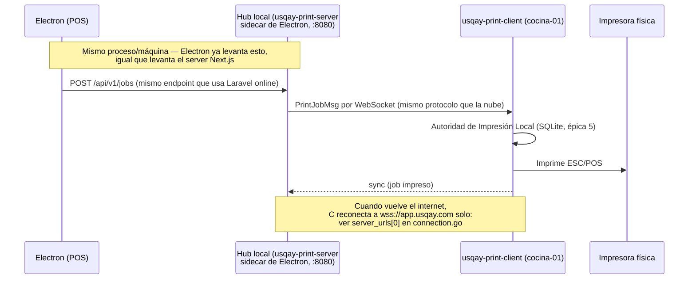

# Propuesta 3 — Hub local embebido en Electron (un solo protocolo online/offline)

## Resumen

En vez de inventar un contrato HTTP nuevo (`:9100/print`) que solo existe para el caso offline, se
reutiliza el protocolo que **ya existe y ya está probado en LAN pura**: el WebSocket de
`usqay-print-server` (`docs/laboratorio-offline.html` es la corrida real de esto, hecha esta misma semana).
Electron pasa a levantar ese mismo binario servidor como un proceso propio, igual que ya levanta el
servidor Next.js (`electron/main.js` ya hace `spawn('node', [serverPath], ...)`), pero escuchando en la
LAN en vez de solo en `localhost`. Cada `usqay-print-client` de cada estación se conecta ahí cuando no hay
internet, con el mismo protocolo Register → Config → PrintJob → Sync que ya usa contra la nube.

## El problema que resuelve

Las Propuestas 1 y 2 resuelven "¿a qué IP le mando el POST?", pero mantienen **dos protocolos distintos**
para el mismo trabajo: WebSocket cuando hay internet (nube), HTTP simple cuando no (LAN). Esa dualidad es
la que más deuda acumula a largo plazo: dos formatos de mensaje, dos lugares donde arreglar un bug de
reconexión, dos maneras de que un job se pierda. Esta propuesta colapsa eso en un solo protocolo con un
solo destino que cambia según haya o no internet.

## Diseño

### 1. `usqay-print-server` viaja empaquetado con Electron, como sidecar

`electron-builder.yml` ya tiene el patrón para esto (`asarUnpack`, binarios externos vía `spawn`). Se
agrega el binario de `usqay-print-server` (compilado para Windows/Linux/macOS) a los recursos de la app:

```yaml
extraResources:
  - from: "resources/usqay-print-server-${os}${ext}"
    to: "usqay-print-server${ext}"
```

Y en `electron/main.js`, junto a `startNextServer()`:

```js
function startLocalPrintHub() {
  const binPath = isDev
    ? join(__dirname, '../resources/usqay-print-server')
    : join(process.resourcesPath, 'usqay-print-server')

  // config.json del hub: sin laravel_base_url (no hace falta resolver contra
  // Laravel en modo local — las impresoras ya se sincronizaron antes de perder
  // internet, ver punto 3) y bind en 0.0.0.0 para que otras máquinas de la LAN lleguen.
  printHub = spawn(binPath, [], { cwd: hubConfigDir, env: process.env })
}
```

Arranca siempre (tenga o no internet) — es barato tenerlo corriendo, y así no hay una ventana de "se cayó
el internet, ahora hay que levantar el hub" con latencia.

### 2. Los `usqay-print-client` reciben una lista de destinos, no uno solo

Cambio en `usqay-print-client/internal/ws/connection.go`: `cfg.ServerURL` (string) pasa a soportar una
lista ordenada de candidatos —

```json
{
  "server_urls": [
    "wss://app.usqay.com/ws",
    "ws://192.168.1.50:8080/ws/agent"
  ],
  "terminal_id": "cocina-01",
  "token": "..."
}
```

`Connection.Run` ya tiene el ciclo de reconexión con backoff (épica 5); el cambio es que, en vez de
reintentar siempre la misma URL, recorre la lista en orden y usa la primera que responda. Cuando la
primera de la lista (la nube) vuelve a estar disponible, el próximo ciclo de reconexión la prefiere de
nuevo — no hace falta lógica especial de "volver", el orden de la lista ya lo expresa.

### 3. El hub necesita saber qué impresoras tiene cada estación, sin Laravel

Hoy `usqay-print-server` solo resuelve la lista de impresoras de un terminal llamando a Laravel
(`validateWithLaravel`). Sin internet eso no sirve. Se agrega una tercera fuente, en orden de prioridad:

```
1. Laravel (si hay laravel_base_url configurado y responde)   → modo nube, ya existe
2. Config estática local del hub (config.json del sidecar)     → nuevo, para modo LAN
3. Última config vista, cacheada en el propio hub               → nuevo, se llena sola online
```

La opción 3 es la interesante a largo plazo: cada vez que el hub sí habla con Laravel (con internet), guarda
la última configuración de impresoras por terminal en su propio SQLite. Cuando se cae el internet, el hub
ya sabe qué impresoras tiene cada estación sin depender de nadie — mismo principio que la config cacheada
que ya existe en `usqay-print-client` (épica 5, story 5.1), aplicado ahora también en el servidor.

### 4. Electron deja de hablarle a `:9100/print` y le habla al hub

`lib/print-dispatch.ts` cambia de un POST simple a lo que ya sabe hacer `EnqueueLaravel`/`POST
/api/v1/jobs` del servidor real (visto en `usqay-print-server/cmd/server/main.go`):

```ts
const HUB_URL = 'http://localhost:8080' // el hub corre en la misma máquina que Electron

async function postToHub(job: PrintJob): Promise<boolean> {
  const res = await fetch(`${HUB_URL}/api/v1/jobs`, {
    method: 'POST',
    headers: { 'X-Internal-Token': HUB_TOKEN, 'Content-Type': 'application/json' },
    body: JSON.stringify({
      job_id: job.job_id, terminal_id: job.terminal_id,
      impresora_name_id: job.impresora_name_id, documento_slug: job.documento_slug,
      payload: job.payload,
    }),
  })
  return res.ok
}
```

Nótese que **Electron le habla al hub siempre por `localhost`** — porque el hub corre en la misma máquina
que Electron. El hub es quien resuelve, vía WebSocket, a cuál de las N estaciones de la LAN reenviar el
trabajo. Ese es el cambio de forma respecto a las Propuestas 1 y 2: ahí Electron necesitaba saber la IP de
*cada estación*; acá solo necesita saber la dirección de *un* hub.

## Flujo



## Escalabilidad

Esta es la que mejor escala **en complejidad del sistema**, no solo en número de estaciones: agregar una
funcionalidad nueva al protocolo de impresión (por ejemplo, notificar estado de impresora, o pedir la
lista de impresoras del sistema operativo — `list_printers` ya existe hoy) funciona automáticamente igual
online y offline, porque es el mismo código. Con las Propuestas 1/2 cada funcionalidad nueva hay que
pensarla dos veces: una para el WebSocket de la nube, otra para el HTTP simple de LAN.

También es la más parecida a lo que ya está probado: el archivo `docs/laboratorio-offline.html` de esta
semana es literalmente esta arquitectura funcionando (servidor + cliente + impresora fake, todo en
127.0.0.1) — solo falta que en vez de un mock de Laravel arrancado a mano, sea Electron quien lo levante
como sidecar, y que en vez de bind a `127.0.0.1` sea a `0.0.0.0` para que otras máquinas de la LAN lleguen.

## Riesgos / trade-offs

| Riesgo | Impacto | Mitigación |
|---|---|---|
| Empaquetar un binario Go dentro de un instalador Electron, por 3 plataformas | Medio — trabajo de build/CI, no de lógica | `asarUnpack` + `extraResources` ya es un patrón que `electron-builder.yml` usa hoy para el server Next.js; extenderlo es mecánico |
| Si la máquina de Electron se apaga, se cae el hub y con él la impresión de TODAS las estaciones offline | Alto | Elegir como "máquina hub" la que menos se apaga (server dedicado o la caja principal, no una tablet); a futuro, combinar con Propuesta 2 para que cualquier máquina pueda asumir el rol de hub |
| Requiere resolver impresoras sin Laravel (punto 3 del diseño) — es trabajo nuevo, no reuso | Medio | Empezar solo con "config estática en el hub" (opción 2) y dejar el cacheo automático (opción 3) para una segunda iteración |
| Un solo puerto de entrada (el del hub) simplifica el firewall vs. Propuestas 1/2 (N puertos) | — (esto es una ventaja, no un riesgo) | — |

## Esfuerzo estimado

- `usqay-print-server`: nueva fuente de resolución de impresoras sin Laravel (~1-2 días), sin tocar el
  protocolo WebSocket existente.
- `usqay-print-client`: `server_urls` como lista con failover en `connection.go` (~1 día, extiende el
  backoff que ya existe de la épica 5).
- `rest_web_react`/Electron: empaquetar el binario como sidecar (~1-2 días de build/CI), reemplazar
  `print-dispatch.ts` para hablarle al hub en vez de a `:9100/print` (~medio día, misma forma que hoy).

Mayor esfuerzo inicial que la Propuesta 1, pero es la que mejor sostiene el sistema si el número de
estaciones, locales, o funcionalidad del protocolo de impresión sigue creciendo — que es justamente el
requisito de "sólida y escalable, no resolver algo para hoy" planteado para esta decisión.
